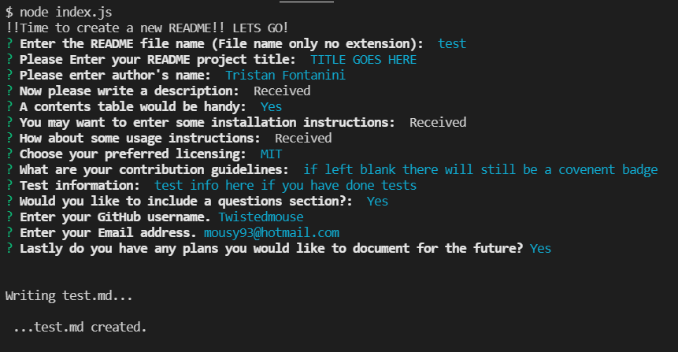

# COMMAND LINE README GENERATOR 
  
  

--- 
--- 

 

## DESCRIPTION: 
This application uses the command line to generate and populate a README in markdown.

---

 

## CONTENTS:
* [Installation](#INSTALLATION:)
* [Usage](#USAGE:)
* [Contribution guidelines](#CONTRIBUTION-GUIDELINES:)
* [Tests](#TESTS:)
* [Questions](#QUESTIONS:)

---

 

## INSTALLATION:

no installation necessary.

---

 

## USAGE: 

This application requires node.js and inquirer.js.

---

 

## CONTRIBUTION GUIDELINES:

 

---

 

## TESTS:

no tests in any test enviroments at this point.

## DEMO: 

---

 

## QUESTIONS: 
If you have questions, head to my [GitHub](https://github.com/Twistedmouse) 
or send an email at mousy93@hotmail.com

  

https://opensource.org/licenses/MIT License
Copyright (c) 2021 Tristan Fontanini

---
---

